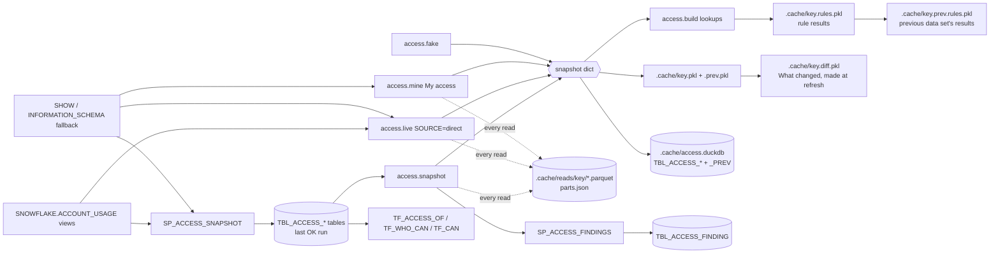

<!-- generated by darshan-singh-meel-knowledge-graph -->
Data model: 11 Snowflake `TBL_ACCESS_` tables (10 snapshot + findings), one in-memory snapshot dict, and a local DuckDB copy; all metadata, never business data.

## Flow

```mermaid
flowchart LR
  AU[SNOWFLAKE.ACCOUNT_USAGE views] --> SP[SP_ACCESS_SNAPSHOT]
  SHOW[SHOW / INFORMATION_SCHEMA fallback] --> SP
  SP --> T[(TBL_ACCESS_* tables<br/>last OK run)]
  T --> SNAP[access.snapshot]
  AU --> LIVE[access.live SOURCE=direct]
  SHOW --> LIVE
  SHOW --> MINE[access.mine My access]
  SNAP --> D{{snapshot dict}}
  LIVE --> D
  MINE --> D
  FAKE[access.fake] --> D
  D --> B[access.build lookups]
  SNAP & LIVE & MINE -.every read.-> PRT[(.cache/reads/key/*.parquet<br/>parts.json)]
  D --> PKL[.cache/key.pkl + .prev.pkl]
  B --> RUL[.cache/key.rules.pkl<br/>rule results]
  RUL --> PRUL[.cache/key.prev.rules.pkl<br/>previous data set's results]
  PKL --> DIFF[.cache/key.diff.pkl<br/>What changed, made at refresh]
  D --> DUCK[(.cache/access.duckdb<br/>TBL_ACCESS_* + _PREV)]
  T --> TF[TF_ACCESS_OF / TF_WHO_CAN / TF_CAN]
  SNAP --> FIND[SP_ACCESS_FINDINGS] --> F[(TBL_ACCESS_FINDING)]
```

- SP writes: `sql/1_setup.sql:867-945`; snapshot read: `access.py:517-580`; live: `access.py:943-1348`; mine: `access.py:786-929`.
- Cache / DuckDB: `cache.py:123-142`, `cache.py:239-306`. Findings: `sql/1_setup.sql:1156-1187`.

## ER diagram (logical; no PK/FK declared in DDL)

```mermaid
erDiagram
  TBL_ACCESS_RUN ||--o{ TBL_ACCESS_GRANT : RUN_ID
  TBL_ACCESS_RUN ||--o{ TBL_ACCESS_USER_ROLE : RUN_ID
  TBL_ACCESS_RUN ||--o{ TBL_ACCESS_USER : RUN_ID
  TBL_ACCESS_RUN ||--o{ TBL_ACCESS_USAGE : RUN_ID
  TBL_ACCESS_RUN ||--o{ TBL_ACCESS_TAG : RUN_ID
  TBL_ACCESS_RUN ||--o{ TBL_ACCESS_POLICY : RUN_ID
  TBL_ACCESS_RUN ||--o{ TBL_ACCESS_STREAM : RUN_ID
  TBL_ACCESS_RUN ||--o{ TBL_ACCESS_OBJECT_USE : RUN_ID
  TBL_ACCESS_RUN ||--o{ TBL_ACCESS_ACTIVITY : RUN_ID
  TBL_ACCESS_RUN ||--o{ TBL_ACCESS_FINDING : RUN_ID
  TBL_ACCESS_USER ||--o{ TBL_ACCESS_USER_ROLE : USER_NAME
  TBL_ACCESS_USER ||--o{ TBL_ACCESS_USAGE : USER_NAME
  TBL_ACCESS_USER ||--o{ TBL_ACCESS_OBJECT_USE : USER_NAME
  TBL_ACCESS_USER ||--o{ TBL_ACCESS_ACTIVITY : USER_NAME
  TBL_ACCESS_ACTIVITY }o--o{ TBL_ACCESS_GRANT : "OBJECT_NAME; ROLE_NAME = GRANTEE_ROLE"
  TBL_ACCESS_USER_ROLE }o--o{ TBL_ACCESS_GRANT : "ROLE_NAME = GRANTEE_ROLE"
  TBL_ACCESS_GRANT }o--o{ TBL_ACCESS_GRANT : "OBJECT_NAME = GRANTEE_ROLE (role link)"
  TBL_ACCESS_TAG }o--o{ TBL_ACCESS_GRANT : OBJECT_NAME
  TBL_ACCESS_POLICY }o--o{ TBL_ACCESS_GRANT : OBJECT_NAME
  TBL_ACCESS_POLICY }o--o{ TBL_ACCESS_TAG : TAG_NAME
  TBL_ACCESS_STREAM }o--o{ TBL_ACCESS_GRANT : "STREAM_NAME = OBJECT_NAME"
  TBL_ACCESS_RUN { varchar RUN_ID PK }
  TBL_ACCESS_GRANT { varchar RUN_ID FK varchar GRANTEE_ROLE varchar PRIVILEGE varchar GRANTED_ON varchar OBJECT_NAME boolean IS_FUTURE }
  TBL_ACCESS_USER_ROLE { varchar RUN_ID FK varchar USER_NAME varchar ROLE_NAME }
  TBL_ACCESS_USER { varchar RUN_ID FK varchar USER_NAME }
  TBL_ACCESS_ACTIVITY { varchar RUN_ID FK date DAY varchar USER_NAME varchar ROLE_NAME varchar CLIENT varchar OBJECT_NAME varchar ACTION varchar QUERY_TYPE number QUERIES variant HOURS varchar APP }
```

- Role link: `GRANTED_ON IN ('ROLE','DATABASE_ROLE') AND PRIVILEGE='USAGE'`, grantee not an admin role: `sql/1_setup.sql:982-986`, `access.py:1534-1538`.
- Tag inheritance: a tag row counts for an object when its `OBJECT_NAME` equals the object (own or column tag), or equals the object's `DB.SCHEMA` (SCHEMA row) or `DB` (DATABASE row) from `split_name(obj)`: exact matches, not a prefix match (`access.py:2878-2894`).
- Tag-based policy (`OBJECT_NAME` empty) joins by `TAG_NAME`: `access.py:2948-2951`.
- Stream → sensitive source (rule 22): `access.py:6603-6615`.
- Activity → grants (inferred): rules 24-28 use only objects known from the grants (`o in kinds`, `access.py:6669`), and `used_path` walks from `ROLE_NAME` to a grant on `OBJECT_NAME` (`access.py:5622-5624`).
- Full list with evidence: `data/model.json` → `relationships`.

## Versioning

- Every data row carries `RUN_ID`; after an OK run all other runs' rows are deleted, except those of a run still RUNNING and started within the last day (an older one is taken as dead): `sql/1_setup.sql:939-944`.
- FAILED run deletes its own rows: `sql/1_setup.sql:932-934`. A second CALL within 1 h of a RUNNING one is SKIPPED (insert first, then look: the run's RUNNING row goes in, then the earliest RUNNING run of the last hour (ORDER BY STARTED_AT, RUN_ID) goes on and any other deletes its own row and returns SKIPPED, so two CALLs a moment apart can no longer both start): `sql/1_setup.sql:872-880`.
- `TBL_ACCESS_ACTIVITY` is carried forward: the new run copies the previous OK run's rows older than the day before its last day, then reads only from there (`sql/1_setup.sql:794-804`); 60 days kept (`ACTIVITY_DAYS`, `sql/1_setup.sql:209`). Its `DAY` and `HOURS` are UTC (`sql/1_setup.sql:120`, `sql/1_setup.sql:757`).
- The nine data tables keep no Time Travel (`DATA_RETENTION_TIME_IN_DAYS = 0` in each CREATE and the `RETENTION_*` statements, `sql/1_setup.sql:133-158`): each run deletes older runs' rows anyway.
- `TBL_ACCESS_OBJECT_USE` is carried forward by week: the previous OK run's weeks but its last two are copied, then ACCESS_HISTORY is read from that Monday, in the same scan as the activity (`sql/1_setup.sql:711-735`, `sql/1_setup.sql:834-864`).
- `TBL_ACCESS_RUN` keeps every run (`sql/1_setup.sql:13`). `TBL_ACCESS_FINDING` keeps only the last run: each `SP_ACCESS_FINDINGS` call deletes every row, then appends, in one transaction (`sql/1_setup.sql:1173-1175`).
- Readers take the newest OK run: `access.py:519-522` (ORDER BY FINISHED_AT), `sql/1_setup.sql:971` (MAX_BY).

## Views and derived sets

| View | Built from | Rows |
|---|---|---|
| `TF_ACCESS_OF(NAME, MAX_DEPTH)` (`sql/1_setup.sql:962-1021`) | RUN, USER_ROLE, USER, GRANT (last OK run) | one per path × privilege a user/role reaches |
| `TF_WHO_CAN(OBJECT_NAME, PRIVILEGE, MAX_DEPTH)` (`sql/1_setup.sql:1023-1067`) | RUN, USER_ROLE, USER, GRANT | one per role or user × path to the object |
| `TF_CAN(USER_NAME, PRIVILEGE, OBJECT_NAME)` (`sql/1_setup.sql:1069-1116`) | `TF_ACCESS_OF` | one per path; no rows = no access |
| snapshot dict (`access.py:517-580`) | TBL_ACCESS_* of last OK run, or live / mine / fake | one list of row dicts per table + `run` |
| DuckDB `TBL_ACCESS_*` (`cache.py:276-296`) | snapshot dict of one read | same as the Snowflake table |
| DuckDB `TBL_ACCESS_*_PREV` (`cache.py:278-280`) | DuckDB tables of the read before | same as the Snowflake table |
| `.cache/<key>.prev.pkl` (`cache.py:88-106`) | replaced `.pkl` of another run | whole dict (What changed, `server.py:2424`) |
| `.cache/reads/<key>/<label>-<hash>.parquet` + `parts.json` (`cache.py:319-581`) | one Snowflake read (a heavy ACCOUNT_USAGE read, a SHOW wave, a snapshot table) | the statement's rows, `__i` = statement index (left out for a one-statement part, `cache.py:489-492`); `parts.json`: file, rows, read_at, statements, colsets, errors, status; parts a whole load did not ask for are pruned (`cache.py:506-514`) |
| `.cache/<key>.rules.pkl` (`server.py:349-371`) | rule checks of the shared data | `stamp` (build key, builtin, `rules_stamp()`, server.py hash) + `memo` findings, rows, ro, breaks |
| `.cache/<key>.prev.rules.pkl` (`server.py:358-360`, read `server.py:374-382`) | `.rules.pkl` of the data set before, set aside when a new data set's results are saved | same as `.rules.pkl`; What changed takes its findings |
| `.cache/<key>.diff.pkl` (`server.py:2457-2474`) | `a.diff()` of the loaded shared data set against the previous snapshot, made by the refresh (`server.compared`, `server.py:3222-3233`) | `stamp` (both data sets, builtin, `rules_stamp()`, server.py hash) + `diff` |

## Pages

- Tables: [TBL_ACCESS_RUN](TBL_ACCESS_RUN.md) · [GRANT](TBL_ACCESS_GRANT.md) · [USER_ROLE](TBL_ACCESS_USER_ROLE.md) · [USER](TBL_ACCESS_USER.md) · [USAGE](TBL_ACCESS_USAGE.md) · [TAG](TBL_ACCESS_TAG.md) · [POLICY](TBL_ACCESS_POLICY.md) · [STREAM](TBL_ACCESS_STREAM.md) · [OBJECT_USE](TBL_ACCESS_OBJECT_USE.md) · [ACTIVITY](TBL_ACCESS_ACTIVITY.md) · [FINDING](TBL_ACCESS_FINDING.md)
- [snapshot-dict.md](snapshot-dict.md) · [duckdb-copy.md](duckdb-copy.md)

## Unclear

- No PK, UNIQUE or FK constraints in any DDL (`sql/1_setup.sql:13-171`): every key is logical.
- Source column semantics marked "to verify" in setup: tags `sql/1_setup.sql:578-579`, `sql/1_setup.sql:598`, policies `sql/1_setup.sql:628`, DESCRIBE body `sql/1_setup.sql:654`, SHOW STREAMS columns `sql/1_setup.sql:681`.
- `TBL_ACCESS_FINDING`: no reader in the app (grep of `access.py`, `server.py`); not in the DuckDB copy (`access.py:79-99`).
