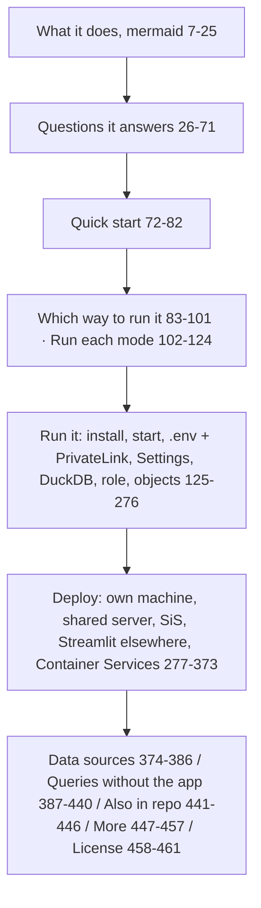

<!-- generated by darshan-singh-meel-knowledge-graph -->
README.md (461 lines): the entry doc — what the app does, quick start, every run mode, settings, the `.env` login (browser SSO, key pair, PrivateLink), objects setup, four deploy targets, data sources, the standalone queries; points to README.html for the full guide.

```mermaid
flowchart TD
  A[What it does, mermaid 7-25] --> B[Questions it answers 26-71]
  B --> C[Quick start 72-82]
  C --> D[Which way to run it 83-101 · Run each mode 102-124]
  D --> E[Run it: install, start, .env + PrivateLink, Settings, DuckDB, role, objects 125-276]
  E --> F[Deploy: own machine, shared server, SiS, Streamlit elsewhere, Container Services 277-373]
  F --> G[Data sources 374-386 / Queries without the app 387-440 / Also in repo 441-446 / More 447-457 / License 458-461]
```

## Sections (verified headings)
- Title + summary; full guide link to README.html — README.md:1-5.
- What it does (mermaid) — README.md:7; Questions it answers — README.md:26.
- Quick start — README.md:72-82; Which way to run it (by what the role can do: local or Streamlit in Snowflake) — README.md:83-101; Run each mode — README.md:102-124.
- Run it (direct vs objects table) — README.md:125-140; Install — README.md:142-151; Start — README.md:153-163; `.env` — README.md:165-180; PrivateLink — README.md:181-196; Settings — README.md:197-212; DuckDB SQL copy — README.md:213; role-based visibility — README.md:244-256; Objects in Snowflake — README.md:257-276.
- Deploy — README.md:277-286; own machine — README.md:287; shared server — README.md:291-310 (PrivateLink bullet README.md:303); SiS — README.md:311-352; Streamlit elsewhere — README.md:353-364; Container Services — README.md:365-373.
- Data sources — README.md:374-386; the Activity tabs and their 60 days of ACCESS_HISTORY + QUERY_HISTORY + SESSIONS — README.md:377-379; Activity tabs on the access and object pages — README.md:32-33; `ACTIVITY` in the DuckDB tables — README.md:217.
- Use the queries without the app — README.md:387-440: file table (5 query files, `functions.sql`, `access_examples.ipynb`) — README.md:390-398; How to use them (worksheet or notebook path A / B) — README.md:400; Needs (ACCOUNT_USAGE read, warehouse, `CREATE FUNCTION` for path A only) — README.md:438; Check (`test_queries.py`) — README.md:439. See modules/access-queries.md, flows/standalone-queries.md.
- Also in this repo — README.md:441-446: access_queries (the Snowflake notebook, `functions.sql`, test) — README.md:442; sf.py CLI — README.md:443; tests incl. `access_queries/test_queries.py` — README.md:444; IaC — README.md:445.
- Where to find more — README.md:447-457; License (MIT or Apache-2.0) — README.md:458-461.

## Login (`.env`, step 3)
- `SNOWFLAKE_ACCOUNT` / `USER` / `ROLE` / `WAREHOUSE`; `<org>-<account>` is the start of the Snowflake URL — README.md:170-175.
- Browser SSO by default, key pair via `SNOWFLAKE_PRIVATE_KEY_FILE` (+ `_PWD`); no passwords; `ALLOW_ID_TOKEN` keeps one login ~4 h — README.md:176-178 (SSO and key pair 176, no passwords 177, `ALLOW_ID_TOKEN` 178).
- PrivateLink (AWS PrivateLink, Azure Private Link, GCP Private Service Connect), linked from README.md:179, section README.md:181-196:
  - No code change: `SNOWFLAKE_ACCOUNT=<org>-<account>.privatelink`, the `regionless-privatelink-account-url` (or `privatelink-account-url`) from `SYSTEM$GET_PRIVATELINK_CONFIG()` without `.snowflakecomputing.com` — README.md:182-187.
  - Private DNS for the account host and the OCSP host (`privatelink-ocsp-url`); a missing OCSP record hangs or fails the certificate check — README.md:188-190.
  - Key pair as is; browser SSO needs the SAML integration on the PrivateLink URLs (`SAML2_SNOWFLAKE_ACS_URL`, `SAML2_SNOWFLAKE_ISSUER_URL`), else use a key pair — README.md:191-193.
  - Check with `python sf.py "select current_user(), ..."`; `run_sql.py` and both apps share the login — README.md:194. Not needed in Streamlit in Snowflake — README.md:195.
  - Shared server: same account value and private DNS there — README.md:303.
  - Code: `sf.connect()` passes the value as `account=` only, no PrivateLink code — sf.py:26. See processes/privatelink-login.md.

## Relates to
- Processes: setup-local, privatelink-login, run-local, deploy-snowflake, build-web, test, container-services.
- Config: .env.example, sis.env.example, settings.sql, requirements*.txt, environment.yml.
- Code: run.py, run_sql.py, sf.py, server.py, app.py, access.py, cache.py, sql/*.sql, access_queries/.
- Contains a clone URL with a personal handle — README.md:75 (not copied into the graph).
