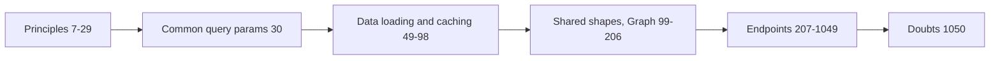

<!-- generated by darshan-singh-meel-knowledge-graph -->
web/API.md (1065 lines): the JSON API contract between server.py and the React app (same shapes inside Streamlit via st_react), with principles, common params, caching, shared shapes and every endpoint.

```mermaid
flowchart LR
  P[Principles 7-29] --> Q[Common query params 30]
  Q --> L[Data loading and caching 49-98]
  L --> S[Shared shapes, Graph 99-206]
  S --> E[Endpoints 207-1049]
  E --> D[Doubts 1050]
```

## Content
- Contract; types in `web/src/api/types.ts` kept in step — web/API.md:1-5.
- Principles: read-only, only POST `/api/reload` and `/api/mine/load`; the only write-like call is `CALL SP_ACCESS_SNAPSHOT('AUTO')` — web/API.md:9-11; no logic in server.py — web/API.md:12-14; one lock — web/API.md:16-19; error JSON — web/API.md:27-28.
- Endpoints, e.g. `GET /api/meta` 209, `POST /api/reload` 247, `POST /api/mine/load` 270, `GET /api/access` 288, `GET /api/list` 318, `GET /api/user` 326, `GET /api/privs` 389, `GET /api/held` 449, `GET /api/object` 455, `GET /api/grantees` 501, `GET /api/check` 538, `GET /api/request` 583, `GET /api/rules` 711, `GET /api/finding` 761, `GET /api/review` 767, `GET /api/whatif` 824, `GET /api/changes` 911, `GET /api/activity` 944, `GET /api/graph` 1042 — web/API.md line numbers.

## Relates to
- server.py (ROUTES), access.py, web/src/api/client.ts, web/src/api/types.ts; processes/access-requests.md (request endpoint).

## Caching as documented
- Shared data and My access: 24 h in memory (`TTL`), `.cache/` for `CACHE_HOURS`, cookie `Max-Age` 86400, answers kept in `ANSWERS` — web/API.md:66-95; matches cache.py:29-30, server.py:33, server.py:75-76.
- `/api/home` and `/api/access` have their own sections.

## Added with the progress lines and switches
- `GET /api/progress?view=`: `{running, view, lines: [{t, text}], job}` of the read running now; `job` = the last background refresh `{id, what, state, ok, message}`, null before any; never starts a load; producer `server.progress()`, lines from `a.say()` — web/API.md:287-294.
- `POST /api/reload`: `load` reads the missing parts and answers when done; `page` / `rebuild` read every part again under their own key and swap it in — locally in a thread (`{ok, started, job}`), inside Streamlit (`server.BACKGROUND = False`) when done; a second refresh while one runs gives `ok: false`; a page that would wait for a load answers 409 `shared_loading` — web/API.md:273-285 (server.py:4153-4225, server.py:231).
- `skipped` on `/api/home` and `/api/rules`: rules that did not run (`a.skipped_rules()`, HIERARCHY=0 / ACTIVITY=0) — web/API.md:308, web/API.md:798-818.

## Paged on the server, lazy graph boxes
- Big pages send one page of rows with `total` / `offset` / `limit` and a CSV of every row: `/api/access` list filters and `groups` — web/API.md:316-347; `/api/privs` (User and, with `of=role`, Role Privileges tables, `limit` at most 1000) — web/API.md:437-453; `/api/held` (Role page held by) — web/API.md:498-502; `/api/object` matrix rows (`m_offset`) and `/api/grantees` (`by=rows|groups`) — web/API.md:504, 501-514; `/api/sensitive` objects and readers (`o_offset`, `r_offset`) — web/API.md:733-745; `/api/review` (`part`, `q`, `sort`, `a.review_parts`) — web/API.md:851-865; `/api/grid` first `GRID_ROWS` (300) of `matched` — web/API.md:877-884.
- Risks & fixes: `/api/rules` counts and groups every finding and sends one page (default 100, at most 500; filters `q`, `area`, `people`, `off`, `by=rule|person|object|grid`, `group=`), the fix texts of one finding from `GET /api/finding?id=` — web/API.md:795-850.
- Lazy boxes: over 300 members a combined box goes out with counts only (`lazy: true`) and the graph carries `src`; lanes over 24 roles or people fold into `lane:<i>` / `lane:<i>:people`; `GET /api/graph?<src>&group=<box id>` answers that box — web/API.md:213-218, 1042-1046. The Map fetches its graph only on the Trace tab (`of=map`, `node=`) — web/API.md:685-689.
- `/api/flow?sel=`: counts instead of user lists, `follow` for the selected box — web/API.md:772-794.

## What changed at refresh time
- `/api/changes` compares reach per granted role (`a.facts`, `a.moved`); the previous snapshot's findings from `.cache/<key>.prev.rules.pkl`; a refresh that brings a new run makes the diff while the replaced run is still built (`server.compared`) and keeps it in `.cache/<key>.diff.pkl`; events one page at a time (`f`, `offset`, `limit`, `events_total`), the first 20 people / objects per event; a same-run refresh leaves the diff to the first open; the event itself lists its first `a.EVENT_NAMES` (200) with `capped: true` past that, and with `subject` the text says some may be missing — web/API.md:1026-1039 (server.py:3208-3227, server.py:4228-4239, access.py:7058).
- Paged tables default to `limit=50` (`PAGE`, server.py:77) — web/API.md:316, web/API.md:437, web/API.md:449.
- Errors: 503 `shared_unreadable` / `mine_unreadable` carry `server.load_error()` (`a.line(error)`, plus the `SNOWFLAKE_WAREHOUSE` hint for 000606) — web/API.md:28.

## Code vs docs

- Naming: the `/api/rules` section and CSV header lines say Rule checks (web/API.md:797, web/API.md:842); the page is Risks & fixes > Findings.
