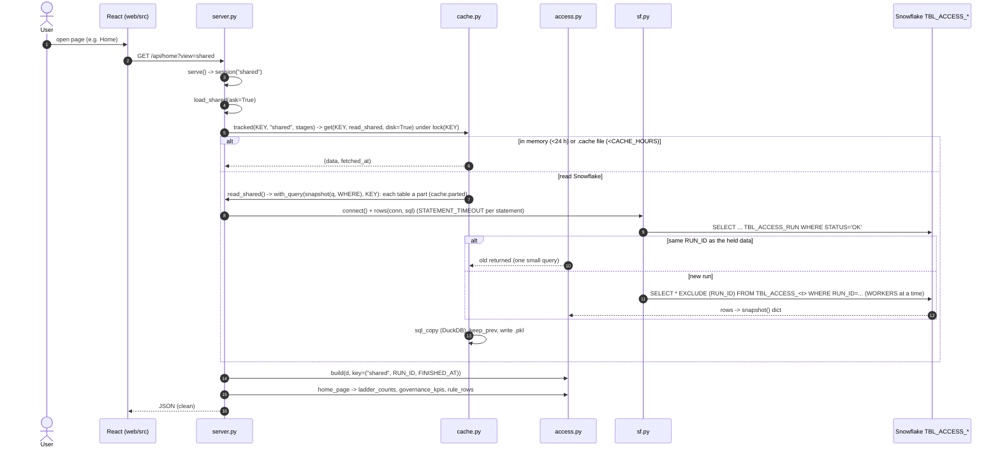
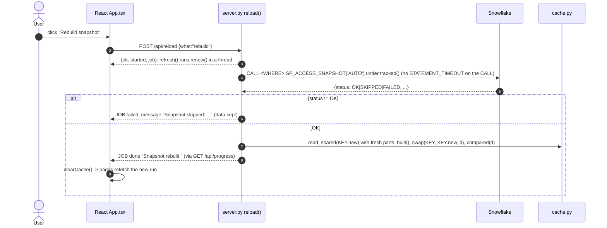

<!-- generated by darshan-singh-meel-knowledge-graph -->
# Flow: shared data from the snapshot tables (SOURCE=objects)

One-line summary: a page asks `/api/<page>`; the server loads the last OK run of the `TBL_ACCESS_` tables once (memory + `.cache/`) through `cache.get` -> `sf.rows`, builds the lookups and answers from `access.py`; "Rebuild snapshot" CALLs `SP_ACCESS_SNAPSHOT` and drops the cache.

## Sequence: first page load

```mermaid
sequenceDiagram
    autonumber
    actor U as User
    participant W as React (web/src)
    participant S as server.py
    participant C as cache.py
    participant A as access.py
    participant F as sf.py
    participant SF as Snowflake TBL_ACCESS_*
    U->>W: open page (e.g. Home)
    W->>S: GET /api/home?view=shared
    S->>S: serve() -> session("shared")
    S->>S: load_shared(ask=True)
    S->>C: tracked(KEY, "shared", stages) -> get(KEY, read_shared, disk=True) under lock(KEY)
    alt in memory (<24 h) or .cache file (<CACHE_HOURS)
        C-->>S: (data, fetched_at)
    else read Snowflake
        C->>S: read_shared() -> with_query(snapshot(q, WHERE), KEY): each table a part (cache.parted)
        S->>F: connect() + rows(conn, sql) (STATEMENT_TIMEOUT per statement)
        F->>SF: SELECT ... TBL_ACCESS_RUN WHERE STATUS='OK'
        alt same RUN_ID as the held data
            A-->>C: old returned (one small query)
        else new run
            F->>SF: SELECT * EXCLUDE (RUN_ID) FROM TBL_ACCESS_<t> WHERE RUN_ID=... (WORKERS at a time)
            SF-->>A: rows -> snapshot() dict
        end
        C->>C: sql_copy (DuckDB), keep_prev, write .pkl
    end
    S->>A: build(d, key=("shared", RUN_ID, FINISHED_AT))
    S->>A: home_page -> ladder_counts, governance_kpis, rule_rows
    S-->>W: JSON (clean)
```

## Steps

1. Settings resolve once at import: `MODE, SOURCE, WHERE = cache.config()` — server.py:27; objects chosen when `SOURCE=objects` or only `ACCESS_SNAPSHOT` is set; location = `ACCESS_SNAPSHOT` or `SNOWFLAKE_DATABASE.SNOWFLAKE_SCHEMA`, else ValueError — cache.py:43-56.
2. Cache key: `KEY` = `shared_data` on Snowflake (one copy per `CACHE_DIR`), `cache.name(SOURCE, where=WHERE)` in fake mode — server.py:29-30, cache.py:59-65.
3. React fetches the page JSON with `get()` (memoised per URL) — web/src/api/client.ts:53-62; Home: `useApi("home", {view})` — web/src/pages/Home.tsx:75.
4. `serve(name, params, sid)` opens `session(view, ...)`, calls `ROUTES[name]`, adds `refs` for pages in `WITH_REFS` — server.py:4315-4336, server.py:4289-4295.
5. `session("shared")` calls `load_shared(ask=True)` and builds the lookups under `LOCK` with the run as key — server.py:325-351.
6. `load_shared` answers from memory / `.pkl` at once; else takes `LOAD` without waiting when a page asks (busy -> 409 `shared_loading`) and runs `tracked(KEY, "shared", stages)`: stage 1 `cache.get(KEY, read_shared, disk=MODE=="snowflake")`, stage 2 `built()` (build + rule checks, or the kept rule results); errors become `503 shared_unreadable` — server.py:186-241 ([flows/two-stage-load.md](two-stage-load.md)).
7. `cache.get`: memory if younger than `TTL` (24 h), else the `.cache/<key>.pkl` file if younger than `CACHE_HOURS`, else `fn()` — cache.py:125-144. Memory TTL — cache.py:30; `CACHE_HOURS` — cache.py:29.
8. `read_shared()` -> `with_query(lambda q: a.snapshot(q, WHERE, old=cache.last(KEY)), KEY)`: the last OK run is asked on every load through `query.fresh` (always asked, never answered from a part, so a newer run shows; the answer is kept for `--build`; the run held costs that one query), every `TBL_ACCESS_` table is a part of its own; inside `tracked()` for the progress lines — server.py:164-176, access.py:551-553, cache.py:587-588, server.py:235 ([flows/load-progress.md](load-progress.md)). No OK run, no RUN_ID or an unreadable `TBL_ACCESS_RUN` -> empty tables with the note `no_run`, kept in memory only; a table that fails -> empty, UNAVAILABLE and noted; a lost session stops the load — access.py:556-594, cache.py:150.
9. `sf.connect()`: inside Snowflake the app's own session (`a.INSIDE`) — sf.py:20-22; else key pair if `SNOWFLAKE_PRIVATE_KEY_FILE`, else SSO `externalbrowser` — sf.py:23-43; `sf.rows` is the only read path — sf.py:51-63.
10. `a.snapshot(query, where, old=...)`: last OK run from `TBL_ACCESS_RUN`, error if none; the same `RUN_ID` as `old` (and `old` in the shape this code reads) -> `old` back after that one query — access.py:567-573 (a run with a table that failed to read, `UNREAD`, is read again); else `SELECT * EXCLUDE (RUN_ID)` per table in `TABLES` (+ `OPTIONAL` unless `ACTIVITY=0`), `WORKERS` at a time through `each()`, an `OPTIONAL` table a setup lacks -> `None`; a run that finished meanwhile -> read again (up to 3 tries); `ACTIVITY=0` -> `OBJECT_USE` / `ACTIVITY` `[]`, sources `SKIPPED` — access.py:546-609.
11. On a fresh read (`store`, cache.py:141): DuckDB SQL copy in a thread if wanted — cache.py:152-155, cache.py:219-224, cache.py:240-307; previous file kept as `<key>.prev.pkl` (for What changed) — cache.py:158, cache.py:90-99; atomic write via `.tmp` — cache.py:159-161.
12. `a.build(d, key, builtin)` fills module lookups; same key skips work; keeps up to `KEEP_BUILT` data sets — access.py:1832-1903, access.py:1814.
13. Page handler (e.g. `home_page`) reads only lookups / `S["rows"]` — server.py:1881-1894; `clean()` makes JSON-safe output — server.py:421.

## Sequence: refresh and rebuild

```mermaid
sequenceDiagram
    autonumber
    actor U as User
    participant W as React App.tsx
    participant S as server.py reload()
    participant SF as Snowflake
    participant C as cache.py
    U->>W: click "Rebuild snapshot"
    W->>S: POST /api/reload {what:"rebuild"}
    S-->>W: {ok, started, job}: refresh() runs renew() in a thread
    S->>SF: CALL <WHERE>.SP_ACCESS_SNAPSHOT('AUTO') under tracked() (no STATEMENT_TIMEOUT on the CALL)
    SF-->>S: {status: OK|SKIPPED|FAILED, ...}
    alt status != OK
        S-->>W: JOB failed, message "Snapshot skipped: ..." (data kept)
    else OK
        S->>C: read_shared(KEY.new) with fresh parts, built(), swap(KEY, KEY.new, d), compared(d)
        S-->>W: JOB done "Snapshot rebuilt." (via GET /api/progress)
        W->>W: clearCache() -> pages refetch the new run
    end
```

14. Buttons: "Rebuild snapshot" (not in fake mode) — web/src/App.tsx:511 -> `refresh("rebuild")` posts `reload {what:"rebuild"}` — web/src/App.tsx:440-444; side "Read Snowflake again" -> `refresh("page")` — web/src/App.tsx:374, web/src/App.tsx:445. After any action `clearCache()` — web/src/App.tsx:423.
15. `reload("rebuild")`: fake -> "Demo: the CALL runs only on Snowflake"; Snowflake mode -> `refresh("rebuild")`: in a thread `renew()` CALLs `{WHERE}.SP_ACCESS_SNAPSHOT('AUTO')` through `with_query` (objects mode); a non-OK status ends the job with `ok=False` and keeps the copy; OK -> every part read again under `KEY.new`, built, swapped in, compared — server.py:4153-4167, server.py:4170-4225 ([background-refresh.md](background-refresh.md)).
16. `reload("page")`: fake mode -> `cache.drop(KEY)` ("Reloaded."); Snowflake mode -> `refresh("page")`, the same read again without the CALL — server.py:4162-4167.
17. `cache.drop`: out of memory, local file set aside as `.old.pkl` so it becomes `.prev.pkl` on the next read — cache.py:190-200, cache.py:90-99.
18. Procedure (owner's rights): inserts its RUNNING row, then steps back (deletes its row, `SKIPPED`) unless it is the earliest RUNNING run of the last hour (sql/1_setup.sql:1157-1165); fills each table, FAILED deletes this run's rows, OK deletes older runs' rows except those of a run RUNNING for under a day (sql/1_setup.sql:1228-1233) — sql/1_setup.sql:174-180, sql/1_setup.sql:1152-1234.
18a. Procedure steps in order: history (object use + activity, started first as async jobs), grants, future grants (schema list), users, usage (async), tags, policies, streams, objects (the inventory's OWNERSHIP rows), then it waits for usage, object use and activity — sql/1_setup.sql:1180-1208. Every data set is read at the highest level that answers, ACCOUNT_USAGE, then INFORMATION_SCHEMA, then SHOW (`P_SOURCE = SHOW`: no ACCOUNT_USAGE); the database list is read once per run (`DBS`) — sql/1_setup.sql:370-377 ([read-levels.md](read-levels.md), [object-inventory.md](object-inventory.md)).
19. Read-only guard: `test_read_only` records every statement and allows only reads plus the `SP_ACCESS_SNAPSHOT` CALL — test_server.py:602.

## Example (FAKE=1, mock query; no Snowflake)

- `cache.config({"ACCESS_SNAPSHOT": "DB1.SNAP"})` -> `('snowflake', 'objects', 'DB1.SNAP')`; `cache.name("objects", where="DB1.SNAP")` -> `local_objects_DB1.SNAP` (no `SNOWFLAKE_ACCOUNT` -> `local`).
- `cache.config({"SOURCE": "objects"})` -> `ValueError: SOURCE=objects needs ACCESS_SNAPSHOT=<DB>.<SCHEMA> ...`.
- `a.snapshot(q, "DB1.SNAP")` with a recording mock serving `a.fake()` sends, in order:
  - `SELECT RUN_ID, FINISHED_AT, SOURCES, NOTES FROM DB1.SNAP.TBL_ACCESS_RUN WHERE STATUS = 'OK' ORDER BY FINISHED_AT DESC LIMIT 1`
  - `SELECT * EXCLUDE (RUN_ID) FROM DB1.SNAP.TBL_ACCESS_GRANT WHERE RUN_ID = 'fake'` … then USER_ROLE, USER, USAGE, TAG, POLICY, STREAM, OBJECT_USE, ACTIVITY (`WORKERS` at a time, so the order between them may vary).
  - A second read with `old=` the first result and the same run: only the `TBL_ACCESS_RUN` query (test_server.test_same_run, test_server.py:648-670).
  - Rows: GRANT 809, USER_ROLE 30, USER 27, USAGE 9, TAG 12, POLICY 6, STREAM 1, OBJECT_USE 341, ACTIVITY 581.
- `GET /api/home?view=shared` (fake): `counts={users:27, roles:85, objects:76, sensitive:5}`, `risks={Critical:0, High:23, Medium:33, Low:12}`, `me.user=ENGINEER_01`.
- `reload({"what":"rebuild"})` (fake): `{ok: False, message: "Demo: the CALL runs only on Snowflake (not FAKE=1)."}`.
- Names `DB1.SNAP` are made up for the example.
