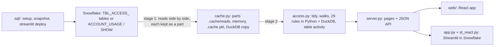

<!-- generated by darshan-singh-meel-knowledge-graph -->
# Snowflake access explorer: knowledge graph index

Read-only app that explains who has what in Snowflake and through which path; this graph maps its code, data, flows, rules and processes (updated 2026-11-17, commit 448bdbb; counts in `meta.json`).

## Big picture

```mermaid
flowchart LR
  SF[Snowflake: TBL_ACCESS_ tables or ACCOUNT_USAGE / SHOW] -->|stage 1: reads side by side, each kept as a part| CACHE
  CACHE[cache.py: parts .cache/reads, memory, .cache pkl, DuckDB copy] -->|stage 2| ACC[access.py: tidy, walks, 29 rules in Python + DuckDB, table activity]
  ACC --> SRV[server.py: pages + JSON API]
  SRV --> WEB[web/: React app]
  SRV --> ST[app.py + st_react.py: Streamlit in Snowflake]
  SQL[sql/: setup, snapshot, streamlit deploy] --> SF
```

- Boxes: Snowflake side (`sql/1_setup.sql`), data and rules (`access.py:508` snapshot, `access.py:883` live, `access.py:1545` tidy, `access.py:3869` duck, `access.py:5790` checks, `access.py:4945` activity), cache (`cache.py`, parts `cache.py:429` parted), server (`server.py:2541` make_app), two front ends (`web/src/App.tsx:256` VIEWS, `app.py:22` st_react.app).
- Login: `sf.connect()` (`sf.py:19-43`) uses the app session inside Snowflake, else a key pair or browser SSO from `.env`; PrivateLink keeps the plain `SNOWFLAKE_ACCOUNT` and adds `SNOWFLAKE_HOST` (the `<org>-<account>.privatelink` host, passed as `host=`) plus private DNS (`sf.py:28-29`, `README.md:186-201`; `processes/privatelink-login.md`).
- Hard rule: the app never runs GRANT / REVOKE / DDL (`CLAUDE.md`, see `documents/claude-md.md`).

## Entry points

- `run.py`: `command()` (`run.py:24-57`) starts the local web app or Streamlit, both on `HOST` (default 127.0.0.1) (`processes/run-local.md`).
- `server.py:2541` `make_app()`: FastAPI app, 33 endpoints (`modules/server.md`).
- `app.py:22`: Streamlit in Snowflake page, runs the same React app (`flows/streamlit-in-snowflake.md`).
- `sql/1_setup.sql`: tables, `SP_ACCESS_SNAPSHOT`, table functions (`data/model.md`, `modules/sql.md`).
- `web/src/App.tsx`: React router and page map (`modules/web.md`).
- `access_queries/`: standalone SQL over ACCOUNT_USAGE, optional `AQ_*` table functions (`access_queries/functions.sql:18`), Snowflake Notebook built by `make_notebook.py`, Jupyter notebook (`modules/access-queries.md`, `flows/standalone-queries.md`).

## Where to look for what

| Question | Go to |
|---|---|
| How does a request / snapshot / My access / what-changed / a standalone query run, step by step? | `flows/` (snapshot-objects, direct-live, two-stage-load, background-refresh, load-progress, web-request, streamlit-in-snowflake, my-access, startup, what-changed, standalone-queries, activity-read, activity-tab, show-sql) |
| Table activity: where it is read (incrementally, app queries left out by the QUERY_TAG / STREAMLIT_APP settings, per UTC day with hours and Streamlit app), what the Activity tab shows per object type (object, app, database / schema scope, warehouse), business hours, rules 24-28 and Streamlit app exposure (rule 29)? | `flows/activity-read.md`, `flows/activity-tab.md`, `logic/activity.md`, `data/TBL_ACCESS_ACTIVITY.md` |
| What does rule N check? How are paths counted, depth, what-if, graph roll-up, caching? | `logic/` (rules, activity, page-sql, walks, rbac-model, what-if, graph-input, diff, caching) |
| What does file / module X do, what calls what? | `modules/` (access, server, cache, sf, app-and-st_react, ui, run-scripts, web, sql, tests, access-queries) |
| Plain SQL / table functions / notebooks over ACCOUNT_USAGE without the app (user roles, user or role access, role holders, object users)? | `modules/access-queries.md` (files, CTEs, functions, notebooks, test), `flows/standalone-queries.md` (worksheet / path A / path B, example rows) |
| Which SQL does a page show to run yourself (the `</>` mark on every card, the top-bar button, right-click), and where does it come from? | `flows/show-sql.md`, `logic/page-sql.md` (`access.page_sql`, `activity_section_sql`, `query_file` on `access_queries/`) |
| Which checks keep `access_queries/` equal to `access.py`? | `modules/access-queries.md` > Test; `processes/test.md` |
| Which tables, columns, joins, dict keys, DuckDB copy? | `data/` (model.md, one page per `TBL_ACCESS_*`, snapshot-dict, duckdb-copy, model.json) |
| How to set up, run, deploy, build the web bundles, test? | `processes/` |
| How do I connect / log in (browser SSO, key pair, PrivateLink or Private Service Connect, SAML URLs, OCSP DNS)? | `processes/privatelink-login.md`, `modules/sf.md` (`connect()`), `processes/setup-local.md` > `.env`, `documents/readme-md.md` > Login |
| Can people export (CSV), how is it turned off, how do long tables page? | `modules/server.md` (`csv_on` / `serve_csv`, `CSV=0` -> 403 `csv_off`), `modules/web.md` components (`CsvOn` / `useCsv`, DataTable pages 25 / 50 / 100 / 250, `Pager`), `modules/tests.md` (test_csv_off, pager.test.tsx) |
| How fast are the reads, how long may a statement run, what does a load show while it runs, how are activity or path-walking rules turned off? | `logic/rules.md` (business rules `statement_timeout`, `parallel_reads`, `progress_lines`, `snapshot_same_run`, `shared_history_read`, `object_use_incremental`, `activity_off`, `hierarchy_off`; Switches section), `flows/load-progress.md`, `flows/direct-live.md`, settings `STATEMENT_TIMEOUT` / `WORKERS` / `ACTIVITY` / `HIERARCHY` (`config:*` nodes, `documents/env-example.md`, `documents/settings-sql.md`) |
| How does a load resume after it stopped, what do `run.py --export` / `--build` do, how does Read Snowflake again keep the old data until the new is built, why does a page answer 409 `shared_loading`? | `flows/two-stage-load.md`, `flows/background-refresh.md`, `logic/caching.md` > Parts, `modules/cache.md` (`parted`, `swap`) |
| What happens with missing, NULL or unreadable data (no snapshot run, refused SHOW, rows without names)? | `data/snapshot-dict.md` > Shape guaranteed by `tidy()`, business rules `missing_data_never_fails`, `no_run_empty` (`logic/rules.md`), `modules/server.md` (`note_info`) |
| Why are the rule checks fast on big accounts, and are rule results kept across restarts? | `logic/rules.md` > Speed on big accounts (`duck`, `lose_all`, `read_shares`, `kept_rules`), `logic/walks.md` > Counted walk in DuckDB |
| What do README / CLAUDE.md / review notes / env templates say? | `documents/` (start at `documents/README.md`) |
| Machine-readable graph (nodes, edges with path:line) | `graph/nodes.jsonl`, `graph/edges.jsonl`; script facts in `graph/parts/structure.*`, hand-written meaning in `_scripts/parts/` |

## Code vs docs

- None open: README.html, web/API.md and the code comments agree on the checked points (business hours local, shifted from UTC by the Activity slider: `README.html:758`, `access.py:104`, `web/src/api/types.ts:1252`; reload / progress background refresh: `web/API.md:236-257`, `server.py:2354-2421`).

## Known gaps

- `unclear` / `inferred` marks are kept on the nodes, edges and pages; each page ends with its own unclear list.
- TypeScript line ranges are approximate (tag `range-heuristic`); vitest cases are not extracted.
