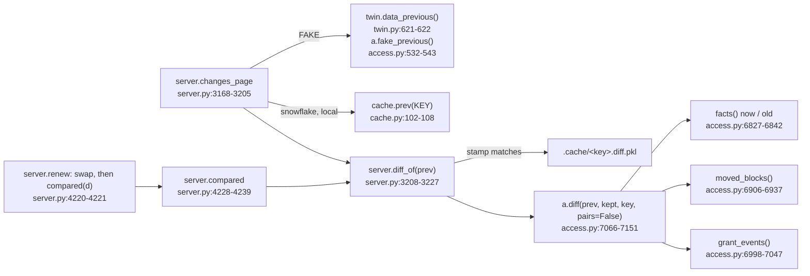

<!-- generated by darshan-singh-meel-knowledge-graph -->
# What changed (facts, diff)

What changed compares the loaded snapshot with the previous one: `facts()` per data set, `diff(prev)` turns differences into events. Locally it is made at refresh time, while the replaced data set is still built, and kept in `.cache/<key>.diff.pkl`; the page sends one page of events with their first `NAMES` people.

```mermaid
flowchart LR
  RN["server.renew: swap, then compared(d)<br/>server.py:4220-4221"] --> CMP["server.compared<br/>server.py:4228-4239"]
  CP["server.changes_page<br/>server.py:3168-3205"] -->|FAKE| FP["twin.data_previous()<br/>twin.py:621-622<br/>a.fake_previous()<br/>access.py:532-543"]
  CP -->|snowflake, local| PR["cache.prev(KEY)<br/>cache.py:102-108"]
  CP --> DO["server.diff_of(prev)<br/>server.py:3208-3227"]
  CMP --> DO
  DO -->|stamp matches| PK[".cache/&lt;key&gt;.diff.pkl"]
  DO --> D["a.diff(prev, kept, key, pairs=False)<br/>access.py:7066-7151"]
  D --> FN["facts() now / old<br/>access.py:6827-6842"]
  D --> MB["moved_blocks()<br/>access.py:6906-6937"]
  D --> GE["grant_events()<br/>access.py:6998-7047"]
```

## When it is made (`server.py:4228-4239`, `server.py:3208-3227`)
- After a refresh swaps in new data, `renew()` calls `compared(d)` (`server.py:4220-4221`).
- `compared()` runs only while the previous snapshot is still kept built (`a.built` holds its `shared_key`); a same-run refresh keeps an older previous one, and building that again would hold every page behind `LOCK`, so then the first open compares (`server.py:4232-4233`). A failure only says so in the load log (`server.py:4238-4239`).
- `diff_of(prev)` keeps one result per pair of data sets: `a.cached(("diff", cache.run_of(prev)), ...)` (`server.py:3227`). Stamp = (previous key, loaded key, builtin, `a.rules_stamp()`, `SERVER_STAMP`) (`server.py:3215`); in Snowflake mode with a local cache it reads and writes `.cache/<key>.diff.pkl` (temp file then replace) and reuses it while the stamp matches (`server.py:3216-3225`).
- The previous snapshot's findings come from `prev_findings()` (`.cache/<key>.prev.rules.pkl` with the same stamp shape), so they are not checked again (`server.py:409-416`, `access.py:7077-7078`).
- `a.diff` is passed `key` (the previous build key), so `loaded()` restores a data set still kept built instead of building it again (`access.py:6814-6824`).

## facts() (`access.py:6827-6842`)
- `of {user: granted roles}` (PUBLIC too), `kids {role: roles it holds}`, `own {role: own_tables()}`: a user's reach is its roles' reach; no (user, object) pair is built per user (`access.py:6837-6838`).
- `grants` keyed `(grantee, privilege, granted on, object)` -> `GRANTED_BY`; links to admin roles and hidden built-ins left out (`access.py:6835-6836`).
- `user_roles`, `findings` (keyed num, grantee, user, detail), `status`, `sens`, `run`, `memo` (`access.py:6839-6841`).
- `fact_level(side, roles, o)` gives (level, privileges) over the object's few holders (`access.py:6889-6898`).

## diff(prev) (`access.py:7066-7151`)
- Old side built with `loaded(prev, key)` (`access.py:7076`); `kept` findings set first (`access.py:7077-7078`).
- Gained / lost = `moved_blocks(now, old)` / `moved_blocks(old, now)` (`access.py:7080`): per user (objects, levels) on `LEVELS` (`access.py:2123`), shared by users with the same granted roles on both sides; only roles whose own grants or held roles differ (dirty) are compared, on the objects they differ on (`access.py:6906-6937`).
- Findings: same (rule, grantee, user) counts as the same finding (`access.py:7081-7083`).
- Grant events for removed and added grants and user-role links (`access.py:7084-7089`), each with the people, objects and top level of its changed pairs and an impact text (`access.py:6998-7047`, `impact_text` `access.py:6988-6995`).
- **Names cap:** an event lists its first `EVENT_NAMES` (200) people and objects (`access.py:7058`, `7100-7101`); `capped` is true when either list was cut (`access.py:7111`); the impact text counts them all.
- User status changes (new, gone, dormant, disabled) (`access.py:7112-7123`); new/fixed findings not tied to a grant event (`access.py:7124-7138`).
- Sort `risk, gain, lose, user, fixed` (`access.py:7139-7140`); counts per filter `event_counts()` (`access.py:7050-7054`); severity strips (`access.py:7143`, `7147`).
- `pairs=False` (what the server asks): `gained` / `lost` pairs are None (millions on a big change); `sens_gained` is still computed from the blocks (`access.py:7148-7150`).

## changes_page (`server.py:3168-3205`)
- Not available on My access, inside Snowflake, or with `CACHE_HOURS=0` (`server.py:3175-3182`).
- `subject=` keeps the events about one node; `f=` (all, gain, lose, risk, sensitive) keeps one filter (`server.py:3185`, `3189-3191`).
- **Paging:** `window(p, "offset", n)` sends `limit=` events (`PAGE`, 0 = all) from `offset=`, with `events_total` (`server.py:3198`, `3262-3284`).
- Each event sends its first `NAMES` (20) people, objects and subjects, plus the subject asked for (`server.py:3165`, `3193-3194`).
- **Capped note:** with `subject=` and any capped event, the text adds "Big changes name only their first EVENT_NAMES people and objects, so some about <subject> may be missing here" (`server.py:3193-3194`).

## Example (fake data, verified)
- `fake_previous()`: a week earlier, GRP_ANALYSTS without F_ANALYST, READ role without INSERT, F_MARKETING with SALES.CORE write, F_ANALYST with an OWNER role, ANALYST_02 not dormant (`access.py:532-543`).
- `diff(fake_previous())` -> counts `all 11, gain 2, lose 2, risk 6, sensitive 7`; new 9, fixed 2; runs `2026-10-26 07:00` -> `2026-11-02 07:00`; no event capped.
- First event: `risk` - `New high finding · #7 Dormant or disabled person can read sensitive data: ANALYST_02`.
