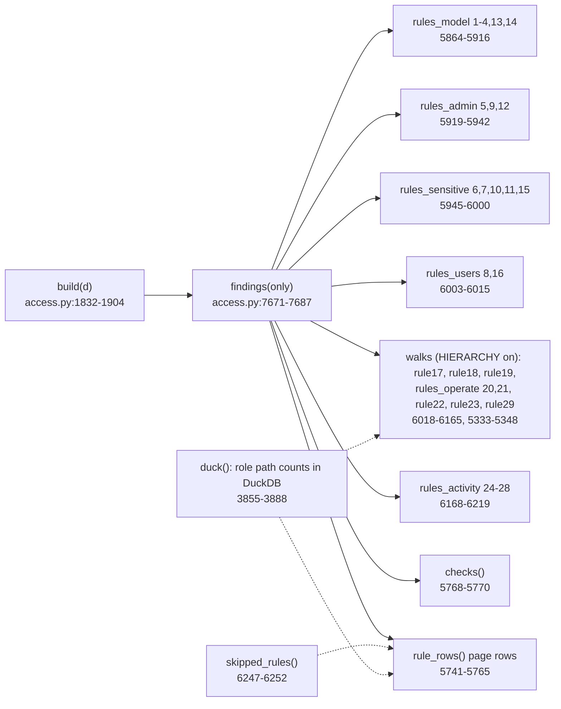

<!-- generated by darshan-singh-meel-knowledge-graph -->
# Rules (29 checks)

The 29 rule checks in `access.findings()`: 1-23 flag risky grants, 24-28 flag table activity (what people did, [activity.md](activity.md)), 29 flags a Streamlit app that shows its owner's sensitive data to people who cannot read it; each row: what it means, severity, where it lives, one real finding from `a.fake()`.

```mermaid
flowchart LR
  B["build(d)<br/>access.py:1832-1904"] --> F["findings(only)<br/>access.py:7671-7687"]
  F --> M["rules_model 1-4,13,14<br/>5864-5916"]
  F --> A["rules_admin 5,9,12<br/>5919-5942"]
  F --> S["rules_sensitive 6,7,10,11,15<br/>5945-6000"]
  F --> U["rules_users 8,16<br/>6003-6015"]
  F --> W["walks (HIERARCHY on): rule17, rule18, rule19,<br/>rules_operate 20,21, rule22, rule23, rule29<br/>6018-6165, 5333-5348"]
  F --> RA["rules_activity 24-28<br/>6168-6219"]
  F --> C["checks()<br/>5768-5770"]
  F --> RR["rule_rows() page rows<br/>5741-5765"]
  K["skipped_rules()<br/>6247-6252"] -.-> RR
  D["duck(): role path counts in DuckDB<br/>3855-3888"] -.-> RR
  D -.-> W
```

## How a finding is made
- Titles and "why" text: `RULES` dict, `access.py:139-179`. Severity: `SEVERITY`, `access.py:180-183` ("edit freely").
- `find(num, grantee, detail, path, edges, edge, user, **kw)` builds one finding dict; `edges` = grant edges the fix removes, `edge` = graph edge it is drawn on (`access.py:7210-7220`).
- `findings(only)` runs the rule groups one after another, each timed, sorted by rule number; the walking groups only when `HIERARCHY_ON`; the load log names the up to 3 slowest groups over 1 s ("Slowest rules: ...") (`access.py:7671-7687`).
- `checks()` = `(num, title, grantee, detail, path)` tuples (`access.py:7205-7207`); the CLAUDE.md verify command uses it.
- `rule_rows()` adds severity, IaC/SQL fix text (`fix_text`, `access.py:4714-4721`), users who lose access (`lose`, `access.py:4740-4757`; with HIERARCHY on, `lose_all` answers every fix edge first in one DuckDB query, `access.py:7186-7187`) and `same_fix` (`access.py:7178-7202`).
- `SCOPED` rules (3,5,7,10,11,14,17,23) can be rechecked for a subset of names (What if); `GROW` (14,17,23) can be started by a removed grant (`access.py:7294-7300`).
- Hidden built-ins never produce rule 9 / 13 findings (`access.py:7336`, `access.py:7370-7374`).

## Speed on big accounts
- `duck()` (`access.py:4794-4831`): an in-memory DuckDB per data set with the role links `E` (parent, child, K grant rows), the start roles `S` of every user (plus PUBLIC) and the path counts `RP` (role, reached role, paths), one `INSERT ... GROUP BY` per hop up to `MAX_HOPS`. None without duckdb, with a role loop (`loops()`), past `MAX_HOPS` or on a DuckDB error (more than 2^127 paths): the Python walk runs then; What if (`only` set) opens no DuckDB ([business_rule:duck_walk](rules.md)).
- `lose_all(edges)` (`access.py:4857-4896`): who loses access for every fix edge in one query: a user loses a role when every path to it uses the link, `paths(user, grantee) x K = paths(user, role)`; privilege edges: users reaching the grantee and no other holder (`access.py:4892-4896`).
- `read_shares()` (`access.py:4834-4854`): per role the data objects reached, read only, written / owned, owned, and schema CREATE grants reached; `readonly_writes` (rule 17, `access.py:7263-7272`) and `rule23` (`access.py:7590-7597`) walk only the roles one of the heuristics can flag ([business_rule:rule_prefilter](rules.md)).
- `below(role)` (`access.py:2458-2460`): `bfs([role])` once per data set for rules 3 and 14 (`access.py:7323`, `access.py:7345`).
- Equal to the Python walk: `test_duck_reach` (`test_access.py:1277-1294`) on the fake data and `big()`.
- Garbage collection: `gc.set_threshold(700, 10, 1000)` so a big page (200k grant rows with paths) does not pay full collections over the loaded data set (`access.py:30-33`).
- Risks & fixes sends findings a page at a time (`FINDINGS_PAGE`), counts and groups over every finding ([reads.md](reads.md) > Paging).
- Rule results kept across restarts: `server.kept_rules` writes `findings`, `rows`, `ro`, `breaks` to `.cache/<key>.rules.pkl` with `(build key, builtin, a.rules_stamp(), SERVER_STAMP)`; reused while the data, the settings `access.py` reads, `access.py` and `server.py` are unchanged (`server.py:354-377`, `access.py:4770-4774`; `test_kept_rules`, `test_server.py:1455-1487`). `server.built()` works out rule 17 (`ro`), `breaks` and `sens` inside the load and saves the results there, so the first page after "Ready" finds them (`server.py:208-217`; `test_built_ready`, `test_server.py:1490-1502`).

## Switches: rules that do not run
- `HIERARCHY=0` (`config:HIERARCHY`, `access.py:112`): the checks in `WALKS` = {3, 5, 7, 10, 11, 14, 17, 18, 19, 20, 21, 22, 23, 24, 29} do not run; rule 6 runs without its reader count (`affects` None); `rule_rows` counts no "who loses access"; rule 17's What-if breaks list is off (`server.py:347`) — `access.py:7690-7692`, `access.py:7192`, `access.py:7394`. Pages still walk.
- `ACTIVITY=0` (`config:ACTIVITY`): no activity rows, so rules 24-28 (`ACTIVITY_RULES`) are skipped — `access.py:7693`, `access.py:7704-7706`.
- `skipped_rules()` -> `{rule: "skipped (HIERARCHY=0)" | "skipped (ACTIVITY=0)"}` — `access.py:7696-7707`. Risks & fixes and Home send it as `skipped`; `Passing` leaves skipped rules out (`server.py:3496-3536`, `server.py:1898`); the React pages say "N rules skipped: ..." (`skipNote`, `web/src/pages/Risks.tsx:145-149`, `web/src/pages/Rules.tsx:62`, `web/src/pages/Home.tsx:295`) and show the reason instead of "passes" (`web/src/pages/Risks.tsx:369`).
- At the defaults nothing is skipped and every rule has a finding on the fake data (`test_switches`, `test_access.py:528-572`; both versions answer the same JSON, `test_server.py:1670-1705`).

## Rule table
Examples: output of `.venv\Scripts\python -c "import access as a; a.build(a.fake()); a.checks()"`, first finding per rule (count = findings for that rule on fake data). Fake names only.

| # | Name (`RULES`) | Plain words | Sev. | Code | Input -> output example (fake data) |
|---|---|---|---|---|---|
| 1 | Technical role granted to a user or group role | A `T_` role sits directly on a user, or a group role holds a `T_` role | Medium | `access.py:7306-7311` | user ANALYST_02 holds T_SALES_MART_READ -> `ANALYST_02 > T_SALES_MART_READ` (2) |
| 2 | Direct privilege on a functional role | An `F_` role holds a privilege itself instead of via a `T_` role | Medium | `access.py:7312-7315` | F_SECURITY -> `MANAGE GRANTS on ACCOUNT` (2) |
| 3 | READ held directly and through another role | A consumer holds a `..._READ` role directly and also through another held role | Low | `access.py:7316-7327` | ANALYST_02 -> T_SALES_MART_READ, path `ANALYST_02 > GRP_ANALYSTS > F_ANALYST > T_SALES_MART_READ` (3) |
| 4 | OWNER role held by a consumer | A `..._OWNER` technical role held by a user or a non-build, non-technical role | High | `access.py:7328-7334` | F_ENGINEER holds T_SALES_MART_OWNER (1) |
| 5 | Admin role held by a person | A non-service user reaches an admin role (not via another admin role); paths from `admin_paths()`, capped per admin role (`MAX_PATHS` each, shortest first, `access.py:3045-3051`), so 200 paths to SYSADMIN never hide ACCOUNTADMIN | High | `access.py:7362-7368` | ADMIN_01 -> SYSADMIN via `ADMIN_01 > F_SECURITY > SYSADMIN` (3) |
| 6 | Sensitive column without a masking policy | A tagged-sensitive column has no masking policy | Medium | `access.py:7389-7398` | SALES.CORE.TBL_CUSTOMER -> `column BIRTH_DATE: PRIVACY_CATEGORY=QUASI_IDENTIFIER` (3) |
| 7 | Dormant or disabled person can read sensitive data | Inactive non-service user still reads a sensitive object | High | `access.py:7399-7408` | ANALYST_02 -> `last login 109 days ago; reads 3 sensitive: ...` (4) |
| 8 | Disabled user still holds roles | Disabled user with role grants | Low | `access.py:7447-7450` | FIN_14 -> `holds GRP_EMEA_ALL` (1) |
| 9 | Privilege granted to PUBLIC | PUBLIC holds a privilege or role (default account privileges and built-ins excluded) | High | `access.py:7369-7376` | PUBLIC -> `USAGE on WAREHOUSE WH_SALES_XS` (1) |
| 10 | Person can write to a sensitive object | Non-service user reaches write/own on a sensitive object | Medium | `access.py:7409-7422` | ANALYST_01 -> `INSERT on SHARED.LOGGING.TBL_LOGGING` via `GRP_ANALYSTS > T_SHARED_LOGGING_READ` (17) |
| 11 | Sensitive object reachable through a group role | A group role reaches sensitive objects | Low | `access.py:7423-7431` | GRP_ANALYSTS -> `reads 3 sensitive: ...; 2 users` (2) |
| 12 | Admin role is a user's default role | `DEFAULT_ROLE` in `ADMIN` | High | `access.py:7377-7382` | OPS_01 -> `default role SYSADMIN` (1) |
| 13 | Orphan role: no users and no parent roles | Functional/group role nobody holds (technical roles exempt by design) | Low | `access.py:7335-7341` | F_LEGACY_REPORTING -> `holds 1 role: T_SALES_MART_READ; 0 privileges of its own` (1) |
| 14 | Chain deeper than `MAX_DEPTH_RULE` (5) roles | Shortest chain from a user-held role to its deepest grant is > 5 | Low | `access.py:7342-7354`, `access.py:127` | GRP_EMEA_ALL -> `10 roles deep to SELECT on FINANCE.REPORT.TBL_REVENUE; held by 14 users` (1) |
| 15 | Future grant in a schema that holds sensitive data | Read future grant on tables/views in a schema with sensitive objects (not build/admin) | Medium | `access.py:7432-7440` | T_SALES_CORE_READ -> `SELECT on future tables in SALES.CORE` (1) |
| 16 | Dormant user (no login for `DORMANT_DAYS`=90) still holds roles | Not disabled (that is rule 8), not service | Medium | `access.py:7451-7455`, `access.py:126` | ANALYST_02 -> `last login 109 days ago; holds GRP_ANALYSTS, T_SALES_MART_READ` (3) |
| 17 | Read-only role can write | Name (`READ_ROLE_PATTERNS`) or behaviour (>= 80% read-only over >= 5 objects) says read-only, but it writes/owns | High | `access.py:7459-7481`, `readonly_writes` `access.py:7256-7291`, `access.py:128-132` | F_FINANCE_REPORTING -> `DELETE, INSERT, TRUNCATE, UPDATE on FINANCE.REPORT.TBL_REVENUE via T_FINANCE_REPORT_WRITE (inherited); heuristic: name` (4) |
| 18 | Unusual privilege set | Role suffix `_READ/_WRITE/_EXECUTE/_OWNER` -> `CAP_PRIVS`; extra or missing privileges | Low | `access.py:7515-7528`, `unusual` `access.py:7484-7512`, `CAP_PRIVS` `access.py:134-138` | T_SALES_PIPELINE_EXECUTE -> `EXECUTE role holds OPERATE on task ...TSK_LOAD_CUSTOMER; standard EXECUTE: USAGE; extra OPERATE` (3) |
| 19 | EXECUTE TASK held by a person or consumer role | Account `EXECUTE TASK` reaches a non-service user or F/group role (not build) | Medium | `access.py:7531-7545` | ENGINEER_01 -> `EXECUTE TASK on ACCOUNT via F_ENGINEER > T_SALES_PIPELINE_EXECUTE` (2) |
| 20 | OPERATE on a task outside owner/build roles | Task OPERATE held by a role that is not build/admin/owner side | High | `access.py:7553-7564`, `owner_side` `access.py:7548-7550` | T_SALES_PIPELINE_EXECUTE -> `OPERATE on task ...; runs as its owner T_SALES_PIPELINE_OWNER; 1 user reaches it` (1) |
| 21 | Warehouse MODIFY or OPERATE outside owner/build roles | Same for warehouses | Medium | `access.py:7553-7564` | T_SALES_CORE_EXECUTE -> `OPERATE on warehouse WH_SALES_XS; owner T_WAREHOUSE_OWNER` (1) |
| 22 | Stream on sensitive table readable without the table | Consumer reads a stream whose source is sensitive but cannot read the source | High | `access.py:7567-7584` | F_SUPPORT -> `reads stream SALES.PIPELINE.STR_CUSTOMER on sensitive SALES.CORE.TBL_CUSTOMER, but cannot read ...` (1) |
| 23 | CREATE privilege on a schema held by a read-only role | Read-only role (rule 17 heuristics) reaches `CREATE ...` on a schema | High | `access.py:7587-7614` | F_FINANCE_REPORTING -> `CREATE VIEW on schema FINANCE.REPORT via T_FINANCE_REPORT_READ (inherited); heuristic: name` (4) |
| 24 | Person changed data or a table's definition | A person (not a service user) ran WRITE or DDL on a table with a role that does not own it | Medium | `access.py:7632-7642` | ENGINEER_01 -> `INSERT 28, ALTER_TABLE_ADD_COLUMN 3 on SALES.CORE.TBL_CUSTOMER as F_ENGINEER, last 2026-10-30` (1) |
| 25 | Service user used from an interactive client | A service user's queries came from Snowsight, SnowSQL or the Snowflake CLI (`INTERACTIVE`) | High | `access.py:7656-7662` | SVC_DEPLOY -> `Snowsight 7 queries on 1 table, last 2026-10-31` (1) |
| 26 | Admin role used to read or change data | Queries on a table ran with an `ADMIN` role | High | `access.py:7663-7667` | OPS_01 -> `as SYSADMIN: read 1 object, changed 0: FINANCE.REPORT.TBL_REVENUE` (1) |
| 27 | First access to a table in the last 7 days | An active user touched a table for the first time within `NEW_DAYS` (7) | Low | `access.py:7643-7647` | ENGINEER_01 -> `HR.PEOPLE.TBL_EMPLOYEE first on 2026-10-30 (9 queries), none in the 53 days before` (1) |
| 28 | Unusual volume on a table | A day >= 50 queries and > 3x the user's median day on that table (`SPIKE`) | Medium | `access.py:7648-7655` | REPORT_01 -> `400 queries on SALES.MART.VW_CUSTOMER on 2026-10-29, 19x the usual day (median 21)` (1) |
| 29 | Streamlit app shows its owner's sensitive data to people who cannot read it | A role holds USAGE on a Streamlit app whose owner role reads sensitive data, and some of its users cannot read that data through their own roles; the app runs with its owner's rights | High | `access.py:6508-6523`, `app_exposure` `access.py:6468-6481` | T_SALES_MART_EXECUTE -> `opens SALES.MART.ST_CUSTOMER_LOOKUP; its owner T_SALES_MART_OWNER reads sensitive SALES.MART.VW_CUSTOMER; 1 user can't read it themselves: SUPPORT_01` (1) |

## Notes per rule
- 3: no name parsing; only consumer -> technical `_READ` reached through another held role; technical-to-technical links not checked (`access.py:7316-7319`).
- 4: build roles (`BUILD_ROLES`, default `F_DEPLOY`, fnmatch) may hold OWNER roles (`access.py:79-80`, `is_build` `access.py:7224-7225`).
- 5: reach first via `ups()` (no paths) to skip non-admin users (`access.py:7361`).
- 6/7/10/11/15/22: "sensitive" = tags matching `SENSITIVE_TAGS` (`access.py:122-124`), filled in `build()` (`access.py:1899-1903`); `SENS_RULES` = {6,7,10,11,15,22} (`access.py:7057`).
- 12, 13, 14, 6, 18: custom `fix=` text (ALTER USER / DROP ROLE / masking policy / "shorten the chain") instead of REVOKE (`access.py:7341`, `7356`, `7382-7384`, `7399-7400`, `7525-7526`).
- 17: an inherited write on a name-only match that is not mostly read gets a review hint, no SQL (`access.py:7475-7478`).
- 18: standard list sorted with name as tie-breaker so findings are stable across processes (`access.py:7519`).
- Fake data keeps >= 1 finding per rule (CLAUDE.md "Keep FAKE=1 ... at least one finding per rule"; verified: all 29 present above).
- 24-28: input is `acts` (TBL_ACCESS_ACTIVITY or the Direct-mode ACTIVITY rows), not grants; the fix is a review, no SQL (`access.py:7620`); conditions and thresholds in [activity.md](activity.md); cached per data set (`cached("activity", rules_activity)`, `access.py:7676`); one finding each from `fake_activity` (`access.py:473-507`), checked by `test_activity` (`test_access.py:2301-2304`).
- 29: not in `SENS_RULES` or `SCOPED`, so What if rechecks it in full; the finding sits on the role's USAGE edge to the app, so revoking that USAGE fixes it (`access.py:6522`, `test_access.py:2357-2358`); UI area "Sensitive data", fix hint: revoke the USAGE, use a caller's rights connection, or an owner role without the sensitive data (`server.py:579-581`); fake data: app SALES.MART.ST_CUSTOMER_LOOKUP owned by T_SALES_MART_OWNER, USAGE via T_SALES_MART_EXECUTE held by F_SUPPORT (`access.py:205`, `access.py:244-245`, `access.py:286`).
- Tests: `test_rules` (`test_access.py:268`); switches: `test_switches` (`test_access.py:528`, `test_server.py:1670`); 24-28: `test_activity` (`test_access.py:2293`), `test_server.test_activity` (`test_server.py:1199`); 29: `test_activity` (`test_access.py:2355-2358`).

## Findings on the page
- A rule group counts every person its findings affect: `rule_index` keeps all losers of a finding, not the first 50 (`server.py:3408`; `test_rules_paged`, `test_server.py:1084-1086`).
- One aligned row per finding: role or user, what was found, "N users lose access" with the names behind the count, Fix (`FD_HEAD` and `Line`, `web/src/pages/Rules.tsx:197-220`).
